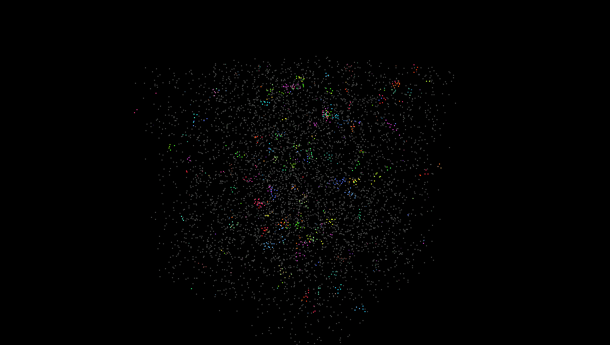
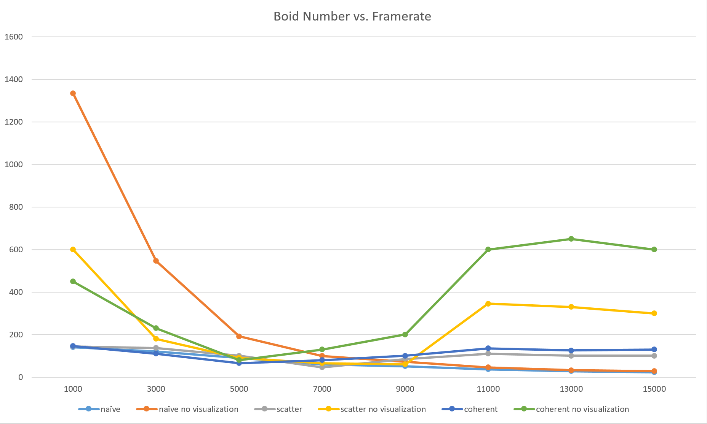
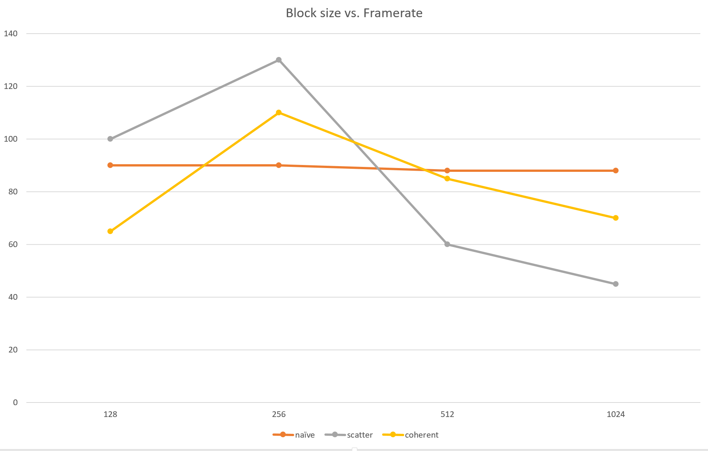

**University of Pennsylvania, CIS 565: GPU Programming and Architecture,
Project 1 - Flocking**

* Yichen Shou
  * [LinkedIn](https://www.linkedin.com/in/yichen-shou-68023455/), [personal website](http://www.yichenshou.com/)
* Tested on: Windows 10, i7-6500U @ 2.50GHz 12GB RAM, GeForce 940M 8GB (Personal Laptop)

## Project Overview
This project is a flocking simulation that implements the [Reynolds Boids algorithm](http://www.vergenet.net/~conrad/boids/pseudocode.html). CUDA is used to increase simulation efficiency. I tested three different performances and analyzed their performance. 

## Performance Analysis
### Boids vs. Performance

* Performance for the naive implementation decreases as expected as boid number increase, since there are simply more boids to check.
* Performance shows an interesting dip for both Scatter and Coherent grids as the number of simulated boids increase. Framerate drops past the 1000 boid mark, and doesn't come back up until past 9000. My theory is that in the middle range, there are a lot of individual boid groups, not close enough to form big groups but not small enough to be trivial, that end up slowing down the framerate. 

### Blocks vs. Performance

* Naive grids are not effected by block size as expected, since it always just checks every other boid.
* Scatter and Coherent grids actually suffer a framerate drop once block size is increased, which is a bit unexpected since increased block size usually increased performance. I suspect that this might have something to do with memory. One hypothesis is that the increased block size is causing more memory to be loaded than needed, thus wasting time to copying memory. 

### Grids vs. Performance
* Coherent performs faster than Scatter, as expected due to the improved algorithm. Compared to the scatter grid, the coherent grid does a little more preprocessing (using a buffer array to reorder data), but yields a good chunk of performance increase especially at high boid numbers. 
* Surprisingly, changing te cell width and checking 27 as opposed to 8 neighboring cells did not affect performance all that much. One would expect that as there are more cells to check, it would be slower, but the result was not so. My theory is that the process of checking boid distance turned out to be quite trivial, and it is actually calculating the rules' effects that take time. Thus simply checking with more boids does not affect the framerate too much. 